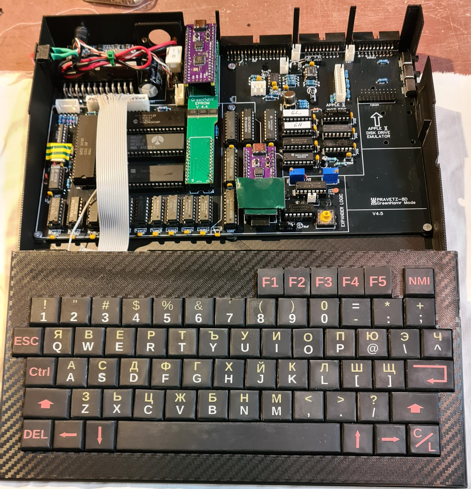
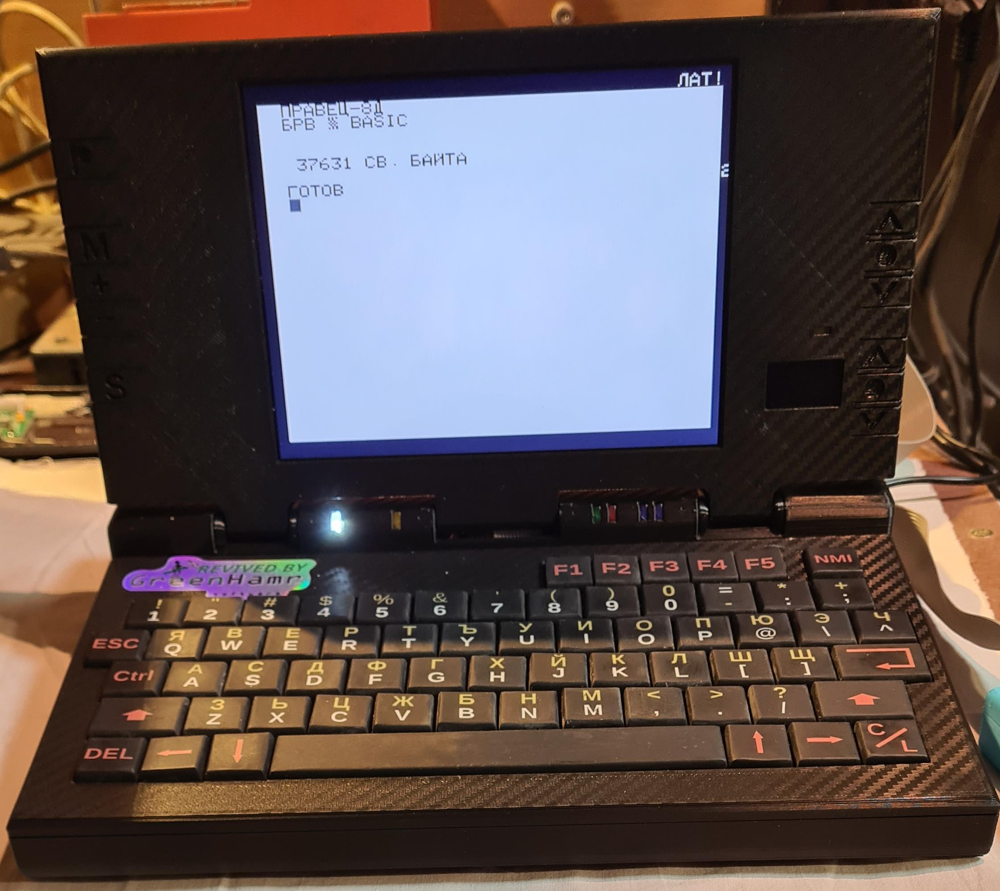

PRAVETZ-8D Plus Project

An 8-bit home computer using a home TV instead of a monitor. 
Programmatically incompatible with Pravets 82 family computers (due to the different architecture). 
An analogue of Oric Atmos. At first, it only works with a tape recorder (after 1990, floppy drives 
for it also appeared, united in one housing with the controller[3]. 
It has improved sound capabilities, through a Yamaha microcircuit. It is widely used for home use 
and for training The extremely attractive price of the model (about 10 times lower than Pravets 82) 
gives high hopes for this model and not a few students have taken their first steps on Pravets 8D.

That's what happened to me. My first personal computer was a Pravetz-8D (Oric Atmos).

About a year ago I remembered my old childhood friend and wondered if I could make one of these.
Of course, first I called my mother to ask her if my old computer was still lying in a basement in my old house. To my great surprise, I found out that she had put it in a briefcase along with a pack of floppy disks.
A little battered and missing a single key, but - WORKING.
Unfortunately, the floppy disk drive and the controller were not preserved.

 
</img>
</img>
 

So, first I decided to make my own floppy disk controller. Some time ago I had bought one from Boyan Mitov - a very well made board.
I searched the internet but couldn't find a schematic. I bought a kit (a blank board plus PROMs) which I filled up and with a few extras I got it working. But the person I bought this board from said that there were only the gerbers and no schematic.

So I set out to develop such a controller myself.
And since we are already in the 21st century, I decided to use a Raspberry Pi (RP2040) microcontroller.

After several unsuccessful attempts and a lot of digging on the Internet , I got to assemble a floppy disk controller based on the RP2040 plus the schematic solution of the APPLE II for a floppy disk controller. (<a href = "https://en.wikipedia.org/wiki/Steve_Wozniak">WOZ</a> STATE MACHINE) - a very good solution.

During the development, I also had the idea of ​​making a dynamic ROM. For this purpose, I used another RP 2040 which simulates the operation of a standard 27C128 ROM, but it has the ability to change four pages from one bank on the fly. I set eight banks that can be selected when the system is started.

I put all this together on one board. I also made a keyboard for it and the result is this:
 
</img>
</img>
 

I designed a box. It also underwent a lot of changes along with the changes in the board.

I encountered a problem with the monitor.
Pravets-8d (orits) has a monitor output (RGBS) which is however at 15kHz. I was unable to find such an LCD monitor. I found a converter board on the internet which works quite well, but it is very large and if I want to make this computer with nice shapes this board does not work for me.
So I set about making my own upscaler - another RP2040 which intercepts the video signal generated by the HCS10017 ULA and converts it to a standard LCD.

After I made the upscaler, I mounted everything in the top cover of the machine.

 
</img>
 

And fully wired : 

 
</img>
 

here is a back of dosplay : 

 
</img>
 

So,
After I did all the wiring, it was finally time to close the whole computer and test it. Everything is OK.

<table border=0>
<tr>
<td></img></td>
<td></img></td>
</tr>
<tr>
<td></img></td>
<td></img></td>
</tr>
</table>

 

<b>Let's talk about the project.</b>

  

For design Schematics and PCBs I use <a target="NEW" href=https://easyeda.com/> EasyEDA </a> system. 
And order boards direcly from this CAD to <a target="NEW" href=https://jlcpcb.com/>JLCPCB</a>

You can find this projects here : 
<table>
<tr><td><a target="NEW" href=https://u.easyeda.com/account/user/projects/index/detail?project=f9a5f7ce3ed544789af7b89d13e4c8b0&listType=all> Main LOGIC - AY-3-8910</a></td></tr>
<tr><td><a target="NEW" href=https://u.easyeda.com/account/user/projects/index/detail?project=a509fb325f5442a4b764fb28fe258eaf&listType=all> Keyboard</a></td></tr>
<tr><td><a target="NEW" href=https://u.easyeda.com/account/user/projects/index/detail?project=205ad6d6b13543d9b9c6c1f6ccf78b0d&listType=all> VIDEO upscaler</a></td></tr>
<tr><td><a target="NEW" href=https://u.easyeda.com/account/user/projects/index/detail?project=bce4df32041e4f5abfc7ceaee0b3d13a&listType=all> EPROM - extender</a></td></tr>
<tr><td><a target="NEW" href=https://u.easyeda.com/account/user/projects/index/detail?project=6507ddaba1c34345acee42c7cf9b6195&listType=all> display and monitor buttons</a></td></tr>
<tr><td><a target="NEW" href=https://u.easyeda.com/account/user/projects/index/detail?project=251d1eb9b4c64a02beb64955f6f17d24&listType=all> LEDs</a></td></tr>
</table>

<b>Changes from original schematics</b>
 

In the original solution of Oric the sound generator AY-3-8912 was used. However, this chip is hard to find and quite expensive (about 30 EURO), so I dug around and found that there is another one from the same series: AY-3-9810 which performs the same functions, is easier to find and is much cheaper. It can be found for about 2 USD.
 
To expand the capabilities of this computer, I also replaced the standard 27C128 EPROM with an emulator that allows you to choose which version of the Program BASIC to choose.
 

Everything else is based on the original ORIC solution.
 

Unfortunately, it is also difficult to find the specialized ULA HCS10017 chip, but it is still available on the market. I found a few on eBay.

